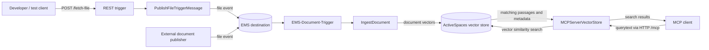
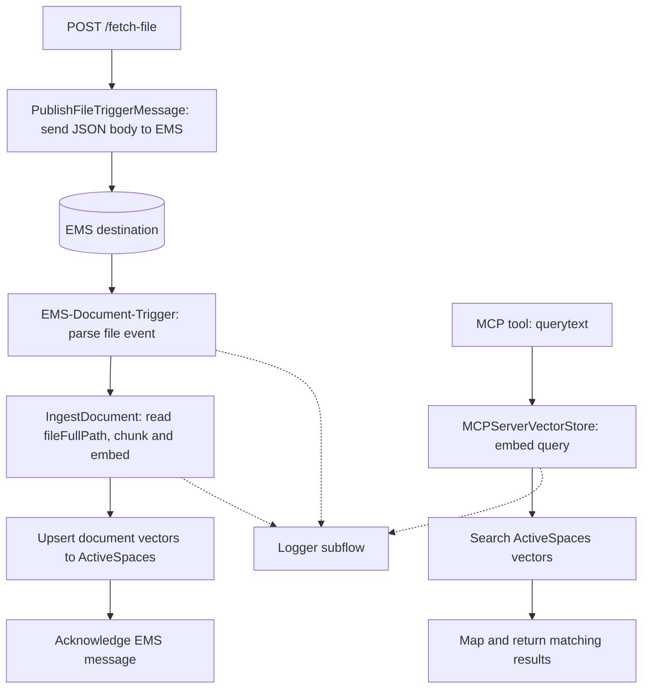

# RAGDemo

`RAGDemo.flogo` is a Flogo application that indexes document changes and exposes semantic search over the indexed content. It has two independent entry points for ingestion (an EMS consumer and a development REST publisher) and one MCP tool for retrieval. It does not generate an answer; the MCP tool returns search results for its caller to use.

## Requirements

- **TIBCO ActiveSpaces 5.2 and FTL:** Run an ActiveSpaces grid reachable through `ActiveSpaces.AS-VectorDB.Grid_URL` and `ActiveSpaces.AS-VectorDB.Grid_Name` (defaults: `http://localhost:13031` and `_default`). Provision a vector table in that grid named by `VECTORSTORE.COLLECTIONNAME` (default: `rag2`). Both ingestion and search use this table; the flows do not contain a table-creation step.
- **Vector table:** Each row represents one document chunk. The upsert mapping writes the fields below; the search activity reads the `embedding` column and returns `id` and `content` with a similarity score.

    | Column | Type | Purpose |
    | --- | --- | --- |
    | `id` | Integer key in the Flogo mapping | Identifies a chunk for upsert/replacement. |
    | `content` | String | Chunk text returned with search matches. |
    | `embedding` | `VECTOR_FLOAT32(1536)` | OpenAI `text-embedding-3-small` vector used for cosine similarity. |
    | `metadata` | String | Serialized chunk metadata. |

    Configure the table's primary key to match the `id` values written by the installed ActiveSpaces vector activity. **Current limitation:** the flow assigns `id` from each document's chunk index (starting again for each document), and upserts with `Replace`; chunks from different documents can therefore overwrite each other. Use unique per-document chunk IDs before indexing multiple documents.
- **TIBCO EMS server:** Configure `EMS.CP-EMS15dev.Server_URL` and credentials for an accessible EMS server. Create or allow the destination named by `EMS.DOCUMENTTRIGGER.DESTINATION` (default: `rag-document`) with type `EMS.DOCUMENTTRIGGER.DESTINATIONTYPE` (default: `QUEUE`). The REST test endpoint publishes to this destination; the EMS trigger consumes its file-event messages.
- **OpenAI API key:** Obtain a valid key with access to the `text-embedding-3-small` model and supply it through the Flogo app property `OPENAI.API_KEY`. Set `OPENAI.BASE_URL` if using a different compatible endpoint. Both document ingestion and MCP search require embedding calls; do not commit the key to this repository.
- **Flogo runtime:** Run the app with the ActiveSpaces/FTL and EMS client libraries available, and ensure the runtime can read document paths supplied as `fileFullPath` in EMS events. `MCPSERVER.HTTP-PORT` controls the MCP HTTP endpoint (default: `18081`); the REST test trigger listens on port `19091`.

## Architecture overview



The REST endpoint is a development aid that publishes a file notification to EMS; it does not index the file directly. The ingestion and MCP paths are linked through the same ActiveSpaces vector store, not by a direct flow-to-flow call.

## Flow connections



The EMS event carries file metadata including `fileFullPath`; `IngestDocument` uses that path to load the document. The `Logger` subflow is reused at several points in ingestion and search. EMS destination, vector-store collection, and MCP port are configured through Flogo app properties.

## Send a test document event

With the Flogo app running, publish a file event through its development REST endpoint:

```bash
curl --request POST 'http://localhost:19091/fetch-file' \
    --header 'Content-Type: application/json' \
    --data-raw '{
        "createdTime": "2026-10-07T09:15:00Z",
        "eventType": "CREATED",
        "fileId": 1042,
        "fileFullPath": "/opt/tibco/as/5.2/product_info/TIB_as_5.2.0_license.pdf",
        "fileName": "TIB_as_5.2.0_license.pdf",
        "modifiedTime": "2026-10-07T09:15:00Z"
    }'
```

The REST flow sends this JSON to EMS; the EMS consumer then ingests the file. `fileFullPath` must exist and be readable by the Flogo runtime (inside its container if containerized). Replace `localhost` with the Flogo host when calling from another machine.